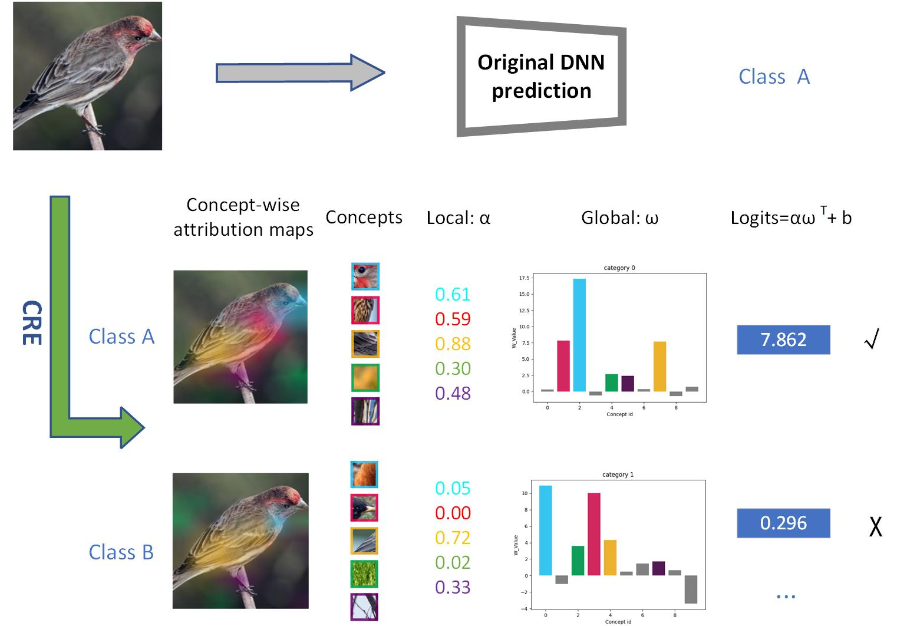
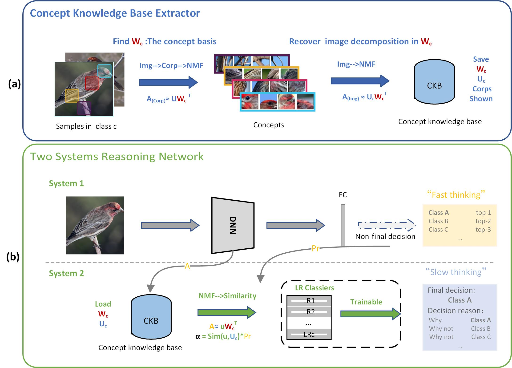
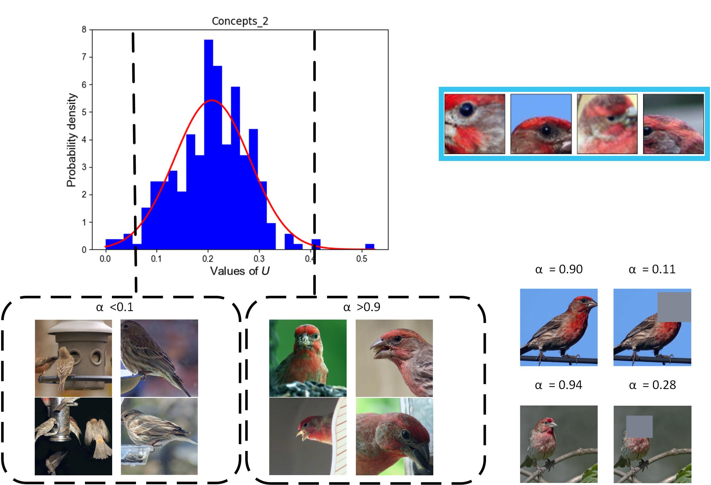

# cre

This project is the paper" Concept-based Reasoning Explanation for Deep Neural Networks: drawing on human thinking" to introduce the framework code implementation.
Once the paper is accepted, publish all the codes.
 

## Work presentation  

##  

### Methord

###  

### Conceptual similarity

###  

### 

## 
